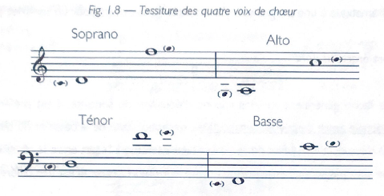

Since 4-part harmony is a "strict" compositional style, the writing of all exercises should be arranged using the classical four choir voices.  from highest to lowest, here are the names of the voices:

- Soprano
- Alto
- Tenor
- Bass

## Tessitura (Vocal Ranges)

Here's a reference guide for the minimum and maximum vocal range for each voice:

## Staves & Stems

Four-part harmony exercises should be written on the grand staff, where the Soprano and Alto are written on the **Treble Clef,** while the Tenor and Bass are on the** Bass Clef**.

When needed, the Soprano and Tenor's stems will be pointing up, while the Alto and Bass should be pointing down.
