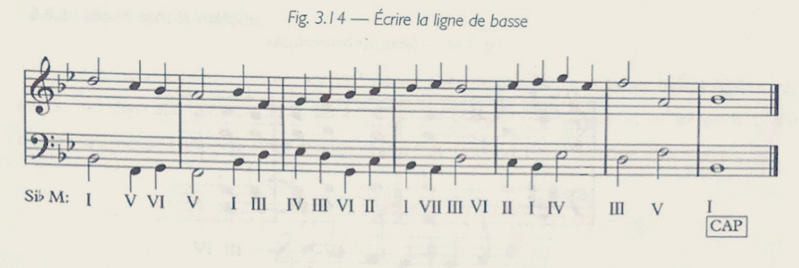

So far in our studies we've seen how to harmonize from a given bass line when all the chords are in root position, so we haven't been given any choice for chords.

Let's learn a technique to help harmonize (choose chords) a given melody.  Here's a soprano line as an example to start:

## Step 1: Analyse the Soprano

- Play it once to get a feel for it and for the direction
- Identify the key the melody is in
	- Bb Major
- Identify the cadenzas
	- in this specific exercise, there are 2 cadenzas: a DC in the middle
- Identify other elements:
	- 7ths
	- Harmonic marches
	- Ornamental notes (Passing Tone, Escaped Note, Embroidery (?))
	- For now though, in our exercises, we'll keep it more simple and assume all notes are part of a chord, and that there are no 7ths.

## Step 2: Identify Possible Chords

- When you have a note on the soprano, it can be harmonized with (at least) 3 different chords.
	- i.e. if you're in C Major and you have C on the soprano: C, Am, F
	- For now, we're not allowing ornamental notes, which means we most likely will need 1 chord per note of the melody.  At least, that's how we're going to write our possible chords.
	- The end must always be V-I

## Step 3: Creation of Harmonic Scheme

Pick a coherent scheme using the tools we've learned

- [Cycle of Fifths](/four-part-harmony/03-harmonization/02-cycle-of-fifths/)
- Substitutions
- Schönberg Analysis

## Step 4: Write the Bass Line

## Step 5: Fill the Inner Voices

