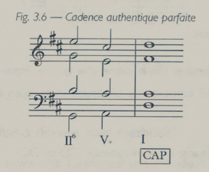
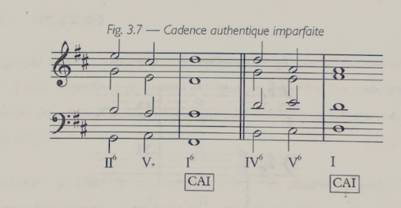
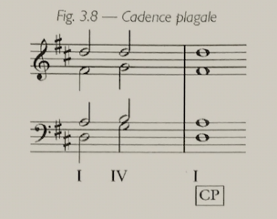
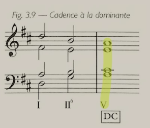
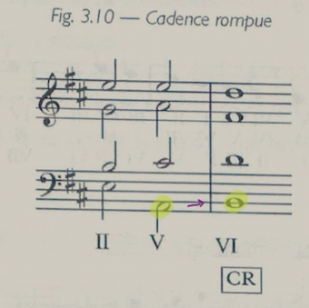

## Functions of Cadenzas

- Cadenzas are stereotypical musical formulas used as punctuation for musical phrasing.
	- Especially having V-I at the end of a phrase.
- At the cadenzas, we often observe changes to the musical texture:
	- Harmonic rhythms (either speeding up or slowing)
	- "The Rule of least effort" sometimes can be pushed aside.
	- More dense chords (such as 7ths, etc)

When writing homework, you'll want to identify them.

## Types of Cadenzas

1. **Conclusive**: Those that sound final
2. **Suspensive**: Those that don't

### (Perfect) Authentic Cadenza (PC or PAC)

- Authentic Cadenza (V-I)
- Perfect Authentic Cadenza (V-I but with lead-tone resolution on the soprano)
- Conclusive
- V-I
- Both chords need to be in root position
- Needs to be cadential resting point
- lead-tone to tonic resolution at the **soprano**
	- It's not absolutely essential, but it sounds more final.

### Imperfect Authentic (IC)

- One of the chords in V-I is inverted:
	- V6-I
	- V-I6

## Plagal Cadenza (PL)

- IV-I
- Is more rare in tonal music but happens
- Usually found at the end of a piece, and following a **Perfect Authentic Cadenza**

## Demi-Cadenza (DC)

- Suspensive cadenza
	- X-V
	- Acts a little bit like a comma in the musical phrasing
	- We always suppose that something else will follow it
- Generally, the V chord will be in root position
- Generally, this cadenza will be followed by some conclusive cadenza (PAC, AC or IC) later in the phrase.
- Usually seen as **triad** (as opposed to a dominant 7th chord, which we'll study later)

The melody template we used to use looked a bit like this:

> X X X DC
> X X X IC/AC
> X X X DC
> X X X PAC

Even if V is followed by I, it CAN be a demi-cadenza, it depends on the phrasing / phrase structure.

## Broken Cadenza (BC)

- Probably my favourite:)
- Looks like AC (V-I), but instead of resolving on I as expected, we substitute it for VI, IV, or III
	- My favourite version is V-VI, it's also the most used one.
- The most typical movement of this cadenza is the bass going from the 5th to the 6th degree.
	- When substituting to IV, the chord will often be in the 1st inversion
- We'll learn more about how to use this cadenza later in our studies

