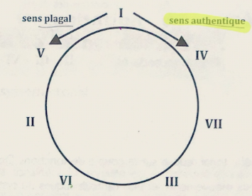
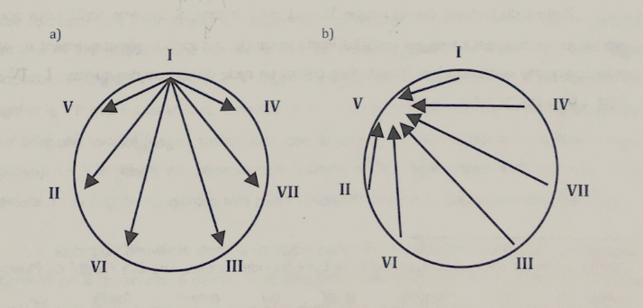
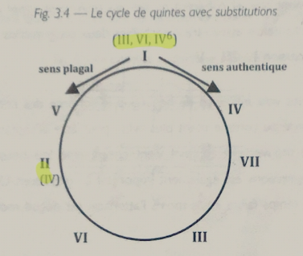

- Like we've seen, the V-I couple is the base of the tonal system.
- This V-I relationship can be extrapolated to other chord relationships.
	- i.e. I-IV, and so on.

The cycle of fifths can move in 2 directions:

1. Authentic: V-I
2. Plagal: I-V

There are 3 stages to a harmonic progression:

1. Approach the dominant
2. Dominant
3. Resolution

Principles for building a harmonic scheme that's tonal and coherent:

1. **I** can move to any degree
2. All degrees can move to **V**
3. You can always move in the authentic direction (clock-wise)

## Substitutions

Some chords in tonal music can be substituted because they share similar "tonal functions", here are some of them:

- I can be replaced by III, VI, or IV6
- II can be replaced by IV

## Hierarchy of Progressions

| Strong                       | Weak     |
| ---------------------------- | -------- |
| Asc. 4rth                    | Asc. 3rd |
| Desc 3rd                     | Asc. 5   |
| Asc & Desc 2 (from or to V) |          |

### Weak Progressions

You CAN use them, but you might want to keep this in mind:

- Don't chain them (I-III-V)
- Step-wise voice-leading
- If you can avoid using those on strong beats.