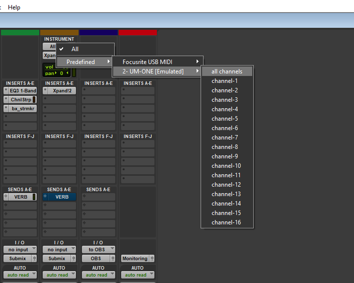

1. Start off with recording an empty midi block on your track
2. Double click it to go ahead and add some notes into it
3. If you want to merge together 2 midi tracks, you need to do a "special paste" using alt+m

## **How to add/change a VST**

(note: there can be only one VST at a time on a track in Pro Tools)

If you don't have an instrument on your track, it's going to appear blue-ish/deactivated

1. click on the first insert on your track
2. search for the VST plugin you want to use (only works with VSTs)
3. select an instrument preset you like
4. (make sure you have something on your track to play or a plugged in midi device/keyboard)
5. play the instrument!

## **Connecting a MIDI device**

[connection instructions to come]

How to set it as an input on your instrument track:

My device it "UM-ONE" but you will need to select yours.

<aside>
💡 Make sure to install the driver first, or you will not find your device OR you'll wonder why it doesn't work

</aside>

### Conditions for it to work

- If you have a MIDI keyboard connected, you will need to enable recording on the track to hear the playback (so hearing your instrument back when you play)
    

    
- You want to make sure there IS in fact an instrument on your track, and I think it needs to be on slot #1
    

    

    

---

## MIDI Recording

This key is called "midi merge" and when activated, it will record midi on top of lines you already recorded (instead of the normal behavior, which is to destroy what you had underneath.  I have it activated most of the time, as it’s a lot more practical and will ensure my performances don’t accidently get overwritten.

<aside>
💡 Pro Tip: If you want to paste some lines on top of each other, use "special paste": alt + m

</aside>

### Learn how to edit MIDI files in Pro Tools here: