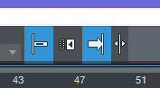
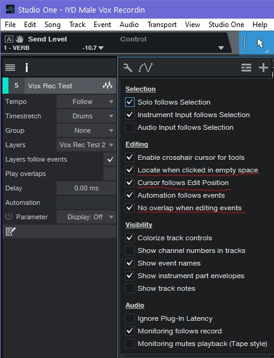

## Import Files Automatically to session folder

> Default behaviour in Studio One

## Import MIDI map & markers

Import midi file directly on the tempo bar (must be unfolded).  Markers are only imported if mini is imported in a new session

## Transport Settings

- Loop follows selection: right click on timeline bar and select (option 2)
- Transport > Options > Return to start on stop ("n" or toggle insertion follows playback)
- Toggle snap to grid:

## Recording settings

- Activate pre-Roll (O)
- pre-roll setup (metronome)

- pre-roll recording: 